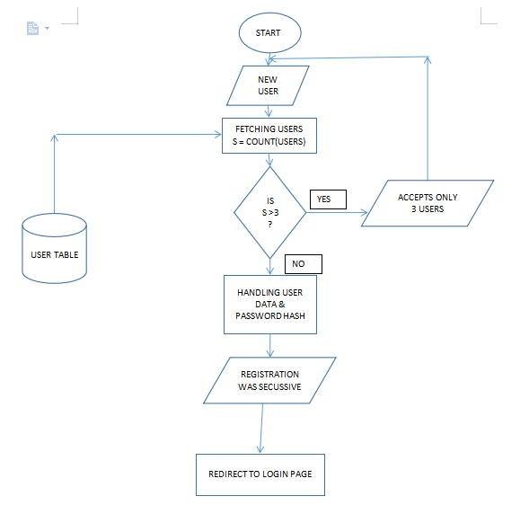
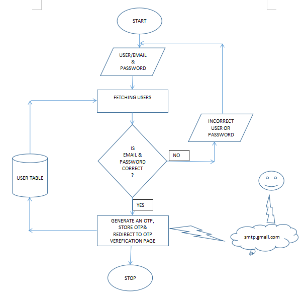
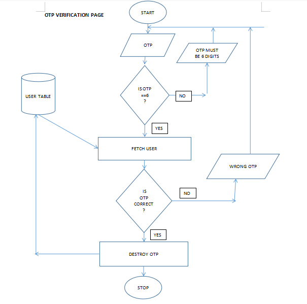

# OTP EXPLAINED 
## FLOWCHATS

### REGISTRATION


### LOGIN



### OTP VERIFICATION


# INSTALLITION
```
// configrations
$my_smtp='smtp.gmail.com'; //your smtp eg smtp.gmail.com
$port =465;//your smtp port
$smtp_auth=true;
$smtp_secure="ssl";
$my_password ="*****"; // your app password as provided by google
$my_username ="bismarquemomanyi@gmail.com"; // you username or email e.g. john@john.com

``` 
this file is in config/SMTP.php